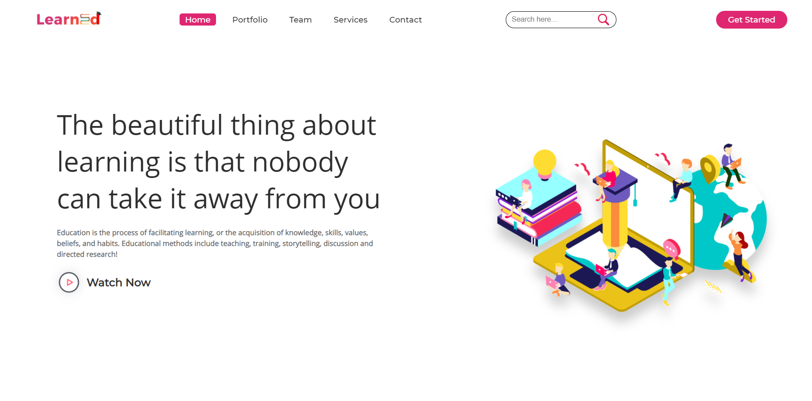

## LearnEd (E-learning Website)
An educational website for students and programmers 😊😊😊  

Try this out::  
https://rohit-rao0.github.io/Educational_Website/

Our Educational Website would provide all the education related stuffs:  
Notes, Sample Papers, Online Video Lectures and courses to crack competitive  
exams like JEE-Main, JEE-Advanced, GATE, etc. Students can clear their doubts  
by sending their questions to our website. We have added Quizzes for Students  
who are willing to solve problems on different topics. We have also added  
Interview questions for students who are preparing for placements.  
  
✔ We have made this website as responsive website so, students or users can  
   easily access our website from  any device.  
✔ Quiz Section is an interesting feature for students which provide them with  
   lots of questions. They can view their scores easily and solutions of every questions.  
✔ Projects – in this I have added a project section where students from schools and  
   colleges can get projects for final year and for Class 12th Board Projects.  
   
It is completely responsive website, to provide smooth experience...😎  

If you like my project, give it a star  😁😁😁
